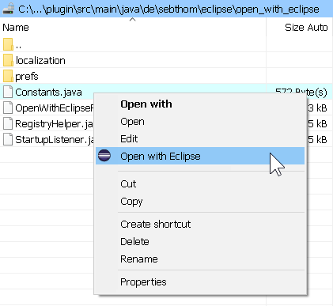
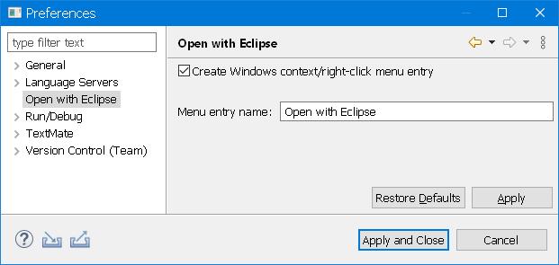

# "Open with Eclipse" plugin for Eclipse

[](https://github.com/sebthom/open-with-eclipse-plugin/actions/workflows/build.yml)
[](LICENSE.txt)
[](CODE_OF_CONDUCT.md)


**Feedback and high-quality pull requests are  highly welcome!**

1. [About](#about)
1. [What is it?](#what-is-it)
1. [Installation](#installation)
1. [Building from Sources](#building)
1. [License](#license)


## <a name="what-is-it"></a>What is it?

This plugin allows you to register a Windows Explorer "Open with Eclipse" menu entry for your Eclipse installation.






## <a name="installation"></a>Installation

To install the plugin into an existing Eclipse installation do:
1. Within Eclipse go to: Help -> Install New Software...
1. Enter the following update site URL: https://raw.githubusercontent.com/sebthom/open-with-eclipse-plugin/updatesite
1. Select the `Open with Eclipse` feature to install.
1. Ensure that the option `Contact all update sites during install to find required software` is enabled.
1. Click `Next` twice.
1. Read/accept the license terms and click `Finish`.
1. Eclipse will now download the necessary files in the background.
1. When the download has finished, Eclipse will ask about installing unsigned content. You need to accept if you want to
1. After installation you will be prompted for a restart of Eclipse, which is recommended.


## <a id="building"></a>Building from Sources

To ensure reproducible builds this Maven project inherits from the [vegardit-maven-parent](https://github.com/vegardit/vegardit-maven-parent)
project which declares fixed versions and sensible default settings for all official Maven plug-ins.

The project also uses the [maven-toolchains-plugin](http://maven.apache.org/plugins/maven-toolchains-plugin/) which decouples the JDK that is
used to execute Maven and it's plug-ins from the target JDK that is used for compilation and/or unit testing. This ensures full binary
compatibility of the compiled artifacts with the runtime library of the required target JDK.

To build the project follow these steps:

1. Download and install a Java 17 SDK, e.g. from:
   - https://adoptium.net/releases.html?variant=openjdk17
   - https://www.azul.com/downloads/?version=java-17-lts&architecture=x86-64-bit&package=jdk

1. Download and install the latest [Maven distribution](https://maven.apache.org/download.cgi).

1. In your user home directory create the file `.m2/toolchains.xml` with the following content:

   ```xml
   <?xml version="1.0" encoding="UTF8"?>
   <toolchains>
      <toolchain>
         <type>jdk</type>
         <provides>
            <version>17</version>
            <vendor>default</vendor>
         </provides>
         <configuration>
            <jdkHome>[PATH_TO_YOUR_JDK_17]</jdkHome>
         </configuration>
      </toolchain>
   </toolchains>
   ```

   Set the `[PATH_TO_YOUR_JDK_17]` parameter accordingly.

1. Checkout the code using one of the following methods:

    - `git clone https://github.com/sebthom/open-with-eclipse-plugin`
    - `svn co https://github.com/sebthom/open-with-eclipse-plugin open-with-eclipse-plugin`

1. Run `mvn clean verify` in the project root directory. This will execute compilation, unit-testing, integration-testing and
   packaging of all artifacts.


## <a name="license"></a>License

If not otherwise specified (see below), files in this repository fall under the [Eclipse Public License 2.0](LICENSE.txt).

Individual files contain the following tag instead of the full license text:
```
SPDX-License-Identifier: EPL-2.0
```

This enables machine processing of license information based on the SPDX License Identifiers that are available here: https://spdx.org/licenses/.

An exception is made for:
1. files in readable text which contain their own license information, or
2. files in a directory containing a separate `LICENSE.txt` file, or
3. files where an accompanying file exists in the same directory with a `.LICENSE.txt` suffix added to the base-name of the original file.
   For example `foobar.js` is may be accompanied by a `foobar.LICENSE.txt` license file.
